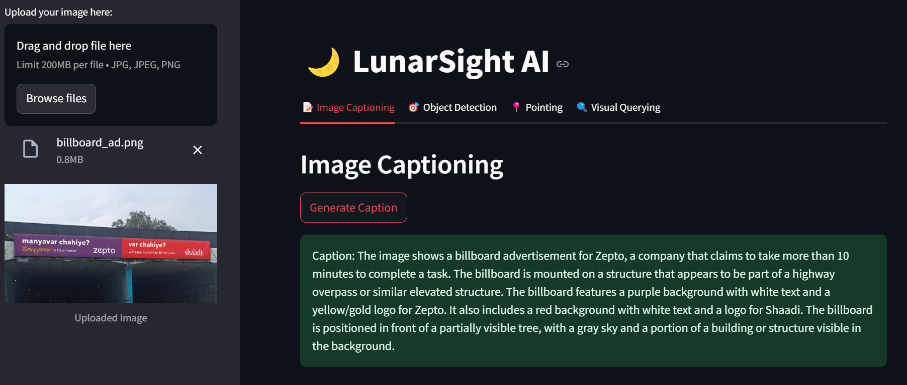
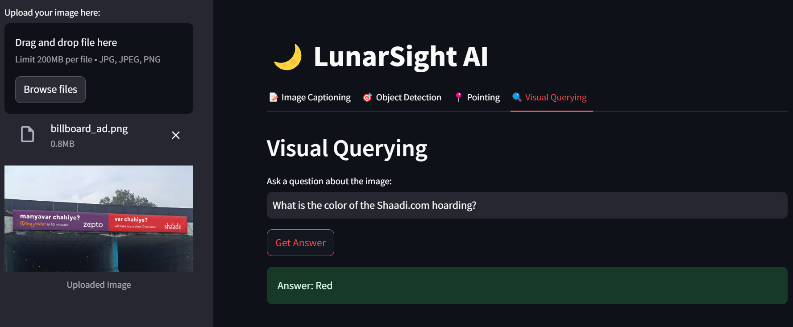

# 🌙 LunarSight AI

A versatile and user-friendly visual analysis interface powered by Moondream VLM, built with Python and Streamlit.

## 🌟 Features

* 📝 Intelligent Image Captioning
* 🎯 Precise Object Detection with Bounding Boxes
* 📍 Object Pointing Capabilities
* 🔍 Natural Language Visual Querying
* 🎨 Clean, Tab-based User Interface
* 💾 Download Options for Analyzed Images
* 🔐 Secure API Key Management

## 🖼️ Demo





## 🔧 Prerequisites

* Python 3.11 or higher
* Web Browser
* Moondream API key from [Moondream Console](https://console.moondream.ai) or download the model file from [here](https://docs.moondream.ai/specifications)

## 📥 Installation

1. Clone the repository:
```bash
git clone https://github.com/smaranjitghose/lunarsightai.git
cd lunarsightai
```

2. Create and activate virtual environment:

```bash
# Windows
python -m venv env
.\env\Scripts\activate

# Linux/Mac
python3 -m venv env
source env/bin/activate
```

3. Install required packages:

```bash
pip install -r requirements.txt
```

## 🚀 Usage

1. Start the application:
```bash
streamlit run app.py
```

2. Open your browser and navigate to:
```
http://localhost:8501
```

## 🎯 Example Use Cases

### 📝 Image Captioning
* Get detailed descriptions of any image
* Perfect for accessibility features
* Useful for content indexing

### 🎯 Object Detection
* "Detect all people in the image"
* "Find books on the shelf"
* "Locate electronic devices"

### 📍 Object Pointing
* "Point to the main subject"
* "Identify the location of logos"
* "Mark all faces in the image"

### 🔍 Visual Querying
* "What colors are dominant in this image?"
* "How many people are wearing glasses?"
* "Describe the environment in the image"

## 🛠️ Troubleshooting

Common Issues:
1. **API Key Error**
   * Verify API key is entered correctly
   * Check if API key has necessary permissions
   * Ensure API key is active

2. **Image Upload Issues**
   * Check if image format is supported (JPG, JPEG, PNG)
   * Ensure image size is reasonable
   * Verify image is not corrupted

3. **Analysis Failures**
   * Check internet connection
   * Verify API quota hasn't been exceeded
   * Ensure prompts are clear and specific

## 🤝 Contributing

Contributions are welcome! Please feel free to submit a Pull Request.

1. Fork the project
2. Create your feature branch (`git checkout -b feature/AmazingFeature`)
3. Commit your changes (`git commit -m 'Add some AmazingFeature'`)
4. Push to the branch (`git push origin feature/AmazingFeature`)
5. Open a Pull Request

## 📝 License

This project is licensed under the MIT License - see the [LICENSE](LICENSE) file for details.

---
Made with ❤️ by [Smaranjit Ghose](https://github.com/smaranjitghose)